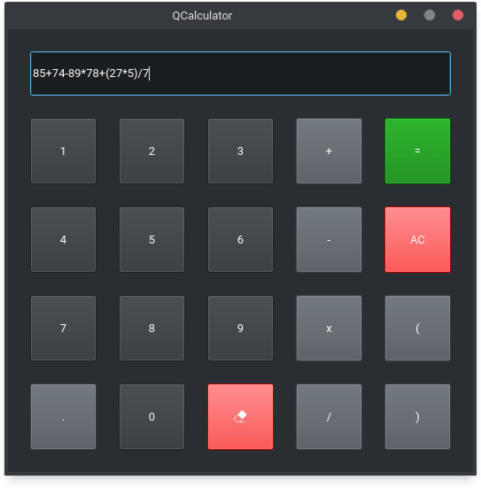

# QCalculator

A simple Calculator for the purpose of learning C++ and QT.

The code used to calculate the expression is from my amazingly skilled friend [@edgararaj](https://github.com/edgararaj/).



### SVG Operation Tree
To generate and view the svg operation tree you can follow these steps:

#### 1st step: Install [graphviz](graphviz.org)
Graphviz is an open source graph visualization software.
```
sudo apt install graphviz
```

#### 2nd step: Generate svg
```console
foo@bar:~/qcalculator/build$ dot -Tsvg tree.dot > tree.svg
```
You can find `tree.dot` on the build directory, and is automatically overwritten on every calculation.

#### 3rd step: View svg and have fun! 🎉
```console
foo@bar:~/qcalculator/build$ firefox tree.svg
```
